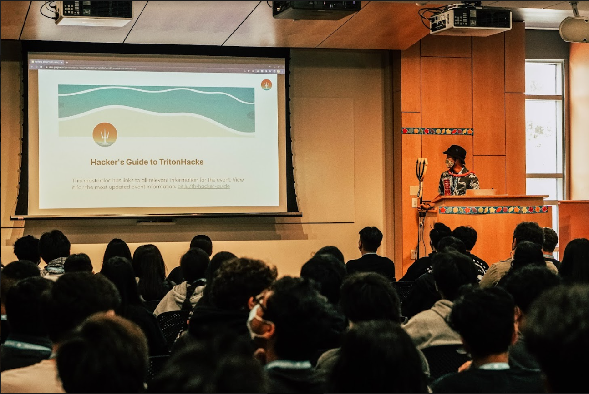
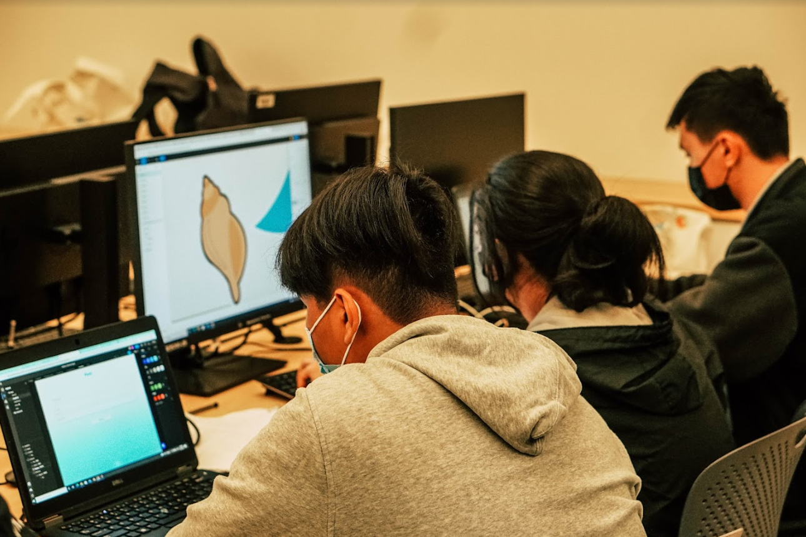
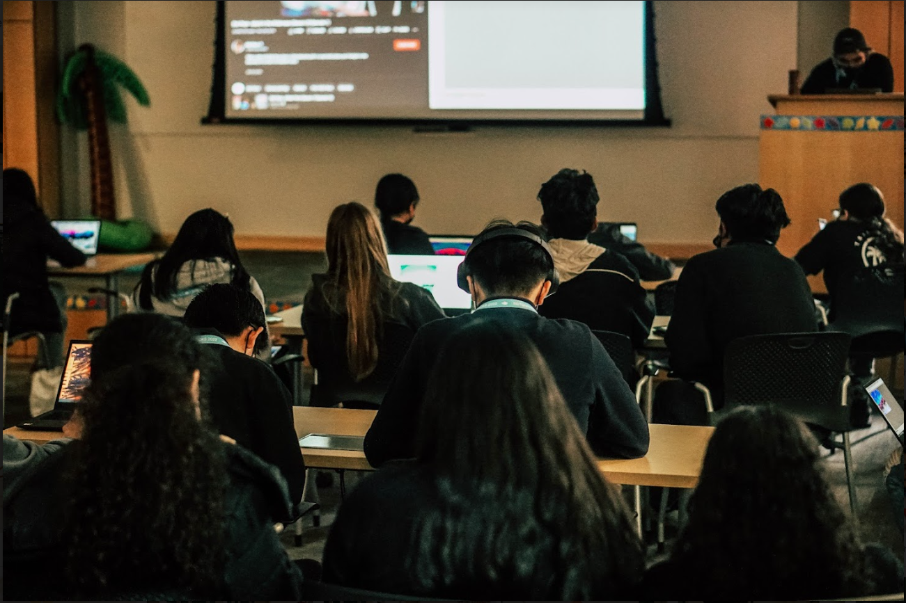
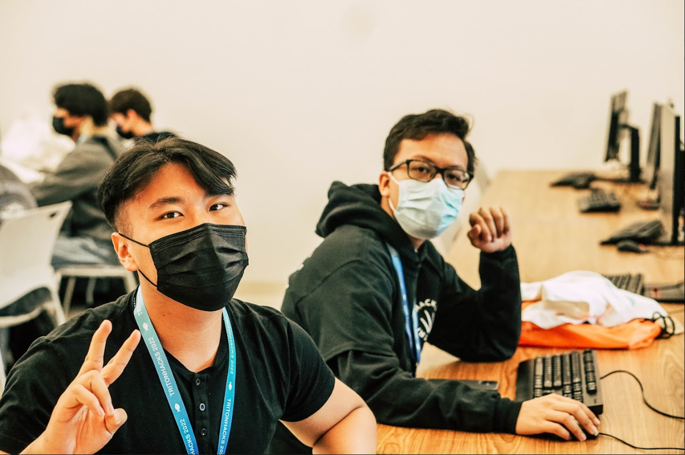
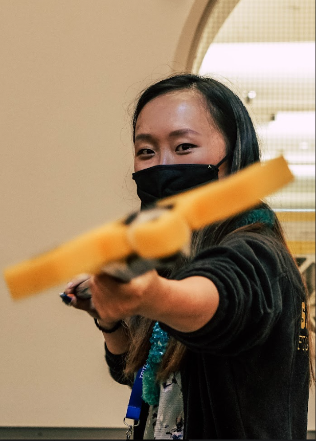
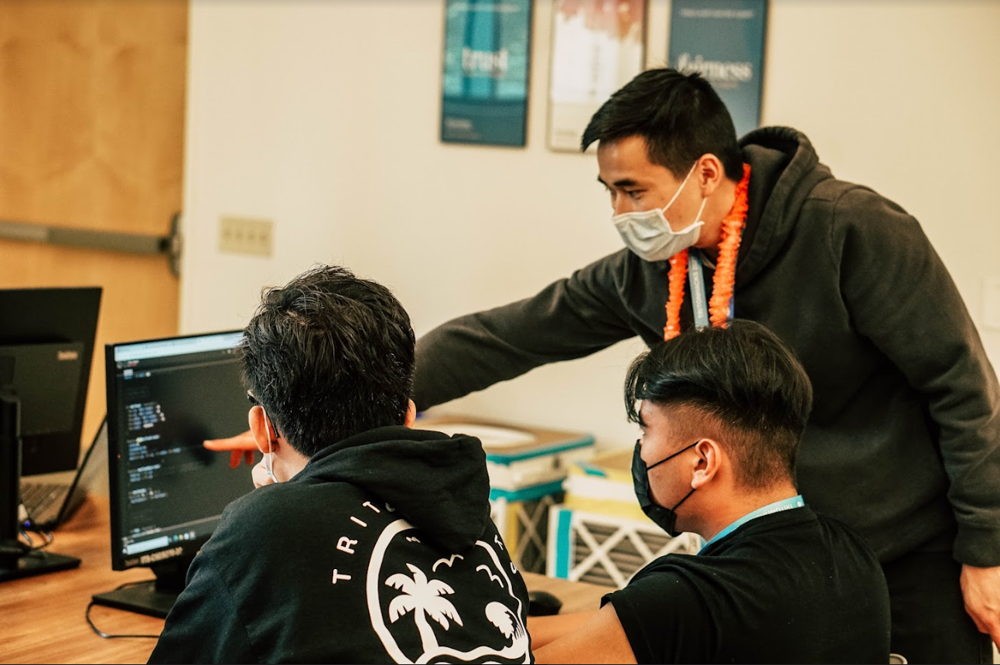
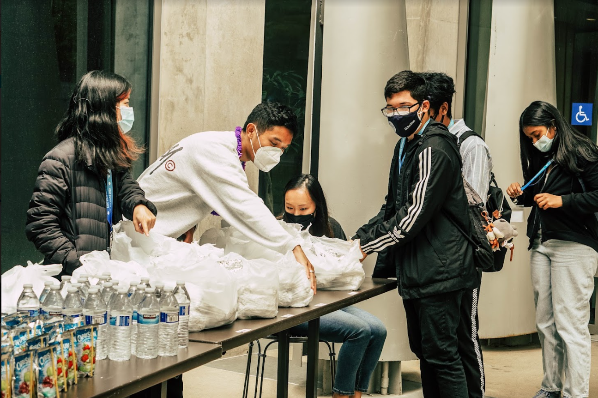
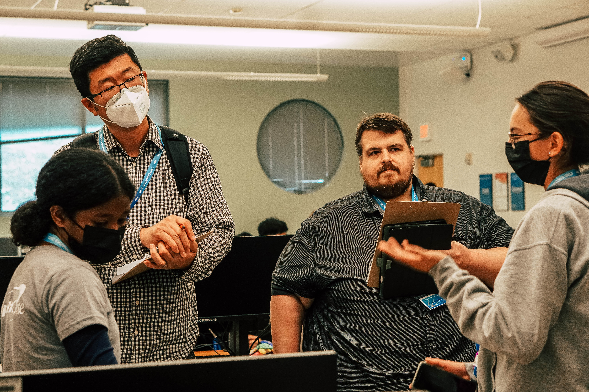
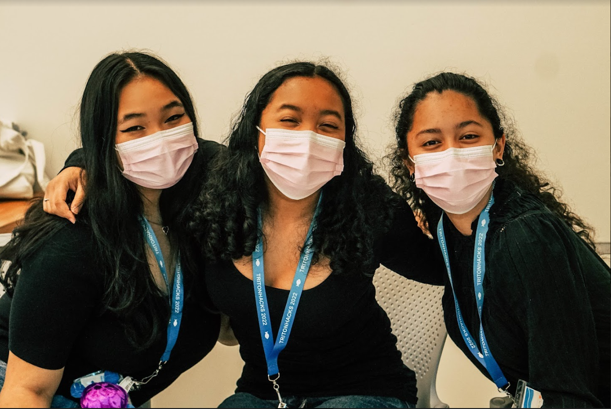

# TritonHacks 2022

#### May 21-22, 2022

#### CS foreach

#### University of California, San Diego

#### La Jolla, CA, USA

 

## Event Summary

TritonHacks is a two-day high school level hackathon aimed at providing greater access to CS education, specifically for disadvantaged local communities lacking their own resources to prepare students for careers in STEM fields.

In addition to typical hackathon incentives such as workshops, teams, and prizes, we placed an emphasis on individual mentorship during the hackathon to ensure that beginners have ways to reach out for help and unblock themselves on their projects. Every student that participated in TritonHacks was assigned a mentor to their team that checked in with them regularly as a point of contact and welcoming figure.

We also offered starter kits designed and documented by our organizing team for students to use as a framework and guide for their project to learn a new technology during the weekend. This year, our event theme was focused on ocean sustainability and ecology so our 6 starter kits were built to address this theme. We had tutors available throughout the event that were proficient in many technologies to answer questions relating to any of the starter kits, Github, software engineering, and any other issues.

As our event focused heavily on community in San Diego, we hosted our hackathon on campus at UC San Diego in the Computer Science and Engineering Building to show students what a university looks like and like as a college student. All meals during the event were catered by local restaurants and venders.

We hosted 3 technical workshops: Intro to Web Development, Image Classification, and Data Visualization, along with a presentation on professional development and a social event (Painting with Bob Ross)!

GitHub was part of the submission process for our hackathon that all hackers went through. Many of the students learned how to work collaboratively in teams for the first time using Github to share their code with help from our tutors. MLH also helped us provide some GitHub stickers and prizes :)

## Event Metrics

| Attendees | First Time Hackers |                                               Projects |
| --------: | -----------------: | -----------------------------------------------------: |
|        69 |                 63 | 23 (https://tritonhacks22.devpost.com/project-gallery) |

## Tech Impact / Diversity

### Tell us about your hacker demographics

As the objective of our hackathon was to reach out to San Diegan high school students of underrepresented backgrounds, we kept track of the hackers that attended. We had 47 males and 22 females, roughly 31.8% of attendees were female.

### What race & ethnicities did your hackers identify as?

| Native American /   Alaskan Native | Black /   African American | Hispanic /   Latinx | Asian | White |
| ------------------------------------: | ----------------------------: | ---------------------: | ----: | ----: |
|                                     2 |                             3 |                     12 |    48 |    10 |

### Where were your hackers from?

| Asia Pacific | North America | Europe / UK | Other |
| -----------: | ------------: | ----------: | ----: |
|            0 |            69 |           0 |     0 |

## Impact of GitHub Grant

Using the GitHub Grant funds, we were able to purchase the prizes for the attendees. Since the prizes were the incentives for the hackers to compete for one category over another, being able to afford nicer prizes created a greater incentive for more hackers to apply and let us reward more students for their creativity and enthusiasm!

## Top Projects

While all the projects can be found on our [Devpost gallery](https://tritonhacks22.devpost.com/project-gallery), here's a little about the grand prize winners! Each of the projects are hosted on GitHub repos for everybody to see how the project was built at the end. Some teams used GitHub for collaboration during this event.

[Ocean Juice](https://devpost.com/software/sound-sensor-arduino-with-web-app): "Noise is amplified in the ocean because sound travels faster in the water. Because of this, sea creatures are fatally affected by noise. Noises as simple as a propeller from a ship to a whale is like firing a 12 gauged shot gun next to a human's ear." To tackle this issue, the team took an arduino to sense noise pollution and transferred the data to a web app which visualized the data in the form of a shaking turtle.

[Coral Guesser](https://devpost.com/software/coral-guesser): Illegal fishing is a problem which damages the ecosystem of sensitive environments across the globe. "For part 1 of our project, we utilized machine learning to whether or not is fishing illegally, when given some data. We also made a fun game where the user would have to guess which beach they were located. After the user made a guess, they would learn about the pollution status of the beach, thus giving the user a deep knowledge on what's going on in the world with respect to ocean pollution."

[Aquatic Ecosystem Simulation](https://devpost.com/software/aquatic-ecosystem-simulation): "The observation of the natural environment and seeing the introduction of species by humans and bringing imbalance to a balanced ecosystem. We coded a fish simulation where there are three types of fish: Goldfish, Tropical Fish, and Sharks. The simulation initially starts with 20 goldfish, 5 tropical fish, and 1 shark. As long as there are two fish of the same type, new fish are born. When the tropical fish collides with a goldfish, the tropical fish "eats" the goldfish and the goldfish disappears. When the shark collides with a tropical fish, the shark will eat that fish. The background of the simulation is a coral reef."

## Event Photos

All of the photos can be found on our [public album](https://drive.google.com/drive/folders/1rWoChMY2Ug0_najx8bfldixXFjKb0A0u) but here's a few highlights!

|  |
| :----------------------------------: |
|         **Opening Ceremony**         |

|  |
| :----------------------------------: |
|      **Hackers hard at work!**       |

|  |
| :------------------------------------: |
|            **Workshopping**            |

|  |
| :--------------------------------: |
|             **Posing**             |

|        |
| :--------------------------------------------: |
| **Volunteer coordinator poking at the camera** |

|     |
| :---------------------------------: |
| **Tutor doing what tutors do best** |

|  |
| :--------------------------------: |
|        **Time to refuel!**         |

|  |
| :------------------------------: |
|           **Judging**            |

|  |
| :------------------------------: |
|       **Girls that code**        |

## What’s Next?

TritonHacks is an annual hackathon. Our next event will likely take place around the same time next year (May 2023). This year, in our second iteration of TritonHacks, we were able to finally host an in-person event and by doing so, we laid a foundation for future iterations of the event and learned the various responsibilities required to host a hackathon. By scaling up our event next year, we can hopefully reach a bigger audience who may not have known about the event or been comfortable enough to attend this year.

We had an overwhelming positive response from the hackers that completed - with event learning new skills and making new connections at the event! With the support from Github and Major League Hacking, we were able to take TritonHacks to the next level as an event with a real impact on its community. Many of our hackers this year were first-time hackers. We hope that they each continue to participate in hackathons and the MLH community and share the word when they come back next year.

[tritonhacks.org](https://www.tritonhacks.org/)

[TritonHacks Instagram](https://www.instagram.com/ucsdtritonhacks/)

[TritonHacks Facebook](https://www.facebook.com/triton.hacks)

[csforeach.org](https://csforeach.ucsd.edu/)

[CS foreach Twitter](https://twitter.com/cforeach)

[CS foreach Facebook](https://www.facebook.com/csforeach)
